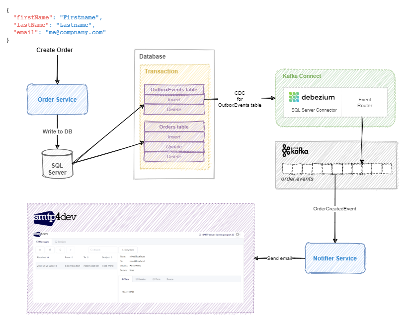

# True Atomic Microservices Implementation with Debezium and Outbox Pattern to Ensure Data Consistency

## Overall Architecture

The overall architecture of the solution can be seen in the following picture:



## Run in Debug Mode

* Run 'docker-compose up' and wait for all infra to up and running.
* Select 'All' debug option and start debugging. (for vs code)
* Wait until all microservices are up and running.

## Register Debezium SQL Server Connector to Kafka Connect

Use /http/debezium.http to register the debezium connector (CreateOrderServiceConnector)

## Kafdrop

http://localhost:9000/

## smtp4dev
http://localhost:5010/

## SQL - Check change data capture configuration

```sql
EXEC sys.sp_cdc_help_change_data_capture
```
